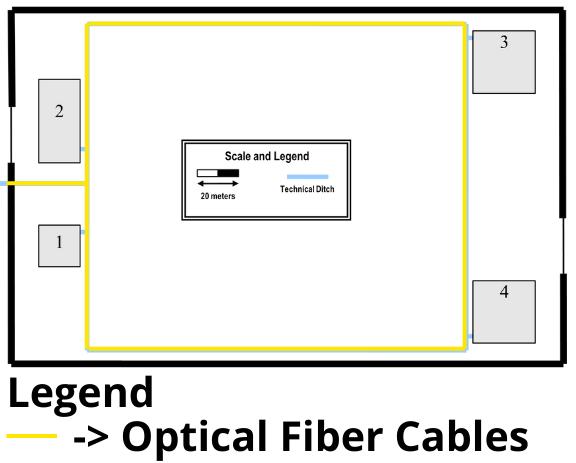

# RCOMP 2022-2023 Project - Sprint 1 - Member 1221083 Folder

Within the subject of Redes de Computadores (RCOMP) each group member got a building to work in. In this report, let's work on the cable structured of the Building 1.

Building 1 has the **Data Center** in the room 1.1.4, which means that this room has all the responsibility to connect every building. The **MCC (Main Cross-Connect)** will be connected to every **ICC (Intermediate Cross-Connect)**.

## Standards

### Acess Point

To be able to get WI-FI network on every floor, we have decided to implement Access Points that, individually, cover 15 meters of diameter.

Since both Floor 0 and Floor 1 has more than 15 meters of diameter, 2 AP will be needed to cover all the space.

### Cables

As defined by the team in the Planning section:

- Copper cables will be **Category 7 (CAT7) Copper Cables**. 
- Fiber cables will be **Optical Fiber Cables**.

The maximum distance of the Copper cables is **90** meters.

### Network Outlets

For each **10** square meters there should be installed **2** Network Outlets. The distance should not exceed **3** meters.

### Patch Panels

Since all connectors and patch panels should meet the cable specifications and we decided to use CAT7 Cables, all of them are also **CAT7**. 
Fiber patch panels to Monomode Optical Fiber should be compatible as well.

### Cross-Connected

Cables connecting an **Intermediate Cross-Connect (ICC)** to a **Horizontal Cross-Connect (HCC)** are limited to **500 meters** long, and cables connecting the **Main Cross-Connect (MCC)** to an **ICC** are limited to **1500 meters** long.

### Copper Patch-Cords

Patch cords go from **0.5 to 5 meters** long. They will be provided to end-users to connect their equipment to outlets.

### Telecommunication Enclosures

Having the number of patch panels we can know the size of our Telecommunication Enclosure. Typical 24 ports CAT7 copper patch panels take **1U**.

**1U** is also added for each corresponding expected switch. And at the end, **100% oversize** must be added.

### Consolidation Point

Since we are using a large set of points of sale, a Consolidation Point must be placed to aggregate a bunch of outlets. In this building, it will be used the **24 ports** and **36 ports** Consolidation Points.

## Measurements

### Campus Backbone

### Building 1

#### Floor 0

#### Floor 1

## No. of outlets

### Building 1

#### Floor 0

| Room  | Length (m) | Width (m) | Area (m^2) | No. of outlets |
|-------|------------|-----------|------------|----------------|
| 1.0.1 | 5.2        | 4.9       | 25.5       | 6              |
| 1.0.2 | 3.5        | 4.9       | 17.2       | 4              |
| 1.0.3 | 4.3        | 4.9       | 21.1       | 6              |
| 1.0.4 | 5.0        | 7.1       | 35.5       | 8              |
| 1.0.5 | 5.8        | 4.5       | 26.1       | 6              |
| 1.0.6 | 5.8        | 7.1       | 41.2       | 10             |

#### Floor 1

| Room  | Length (m) | Width (m) | Area (m^2) | No. of outlets |
|-------|------------|-----------|------------|----------------|
| 1.1.1 | 3.5        | 7.2       | 25.2       | 6              |
| 1.1.2 | 3.5        | 7.2       | 25.2       | 6              |
| 1.1.3 | 3.5        | 7.2       | 25.2       | 6              |
| 1.1.4 | 7.7        | 7.2       | 55.4       | 12             |
| 1.1.5 | 5.5        | 4.4       | 24.2       | 6              |
| 1.1.6 | 5.8        | 7.2       | 41.7       | 10             |
| 1.1.7 | 5.8        | 4.7       | 27.3       | 6              |

## Total of outlets

### Building 1

#### Floor 0

-   **40 + 2 (access points)**

#### Floor 1

-   **52 + 2 (access points)**

## Cabling

### Campus Backbone

### Building 1

#### Floor 0

#### Floor 1

## Cable Measurements

### Building 1

#### Floor 0

##### CAT-7 Copper Cables

The order of outlets in relation to cable structure is: ⬇️ - ➡️ - ⬇️ - ⬅️ - ⬅️- ⬇️ - ⬅️ - ⬆️

- From **HCC** to **CP (1.0.4)** -> **7,4 m**
- From **CP (1.0.4)** to **Outlets (1.0.4)** -> 2,8 m + 4,2 m + 5,6 m + 4,2 m + 6,2 m + 5,6 m + 7,0 m + 8,4 m = **44,0 m**
- From **CP (1.0.4)** to **Outlets (1.0.3)** -> 3,2 m + 4,6 m + 6,0 m + 4,6 m + 6,0 m + 7,4 m = **31,8 m**
- From **HCC** to **CP (1.0.2)** -> **16,2 m**
- From **CP (1.0.2)** to **Outlets (1.0.2)** -> 3,4 m + 4,8 m + 4,8 m + 6,2 m = **19,2 m**
- From **CP (1.0.2)** to **Outlets (1.0.1)** -> 9,4 m + 10,8 m + 12,2 m + 10,8 m + 12,2 m + 13,6 m = **69,0 m**
- From **HCC** to **Outlets (1.0.5)** -> 7,4 m + 8,8 m + 10,2 m + 8,8 m + 10,2 m + 11,6 m = **57,0 m**
- From **HCC** to **CP (1.0.5)** -> **10,5 m**
- From **CP (1.0.5)** to **Outlets (1.0.6)** -> 11,5 m + 12,9 m + 14,3 m + 12,9 m + 14,3 m + 15,7 m + 17,1 m + 14,3 m + 15,7 m + 17,1 m + 18,5 m = **164,3 m**

##### Monomode Optical Fiber Cables

- From **Backbone** to **Floor 0** -> 63,3 m + 519,1 m = **582,4 m**
- From **Floor 0** to **ICC** -> **5,3 m**
- From **ICC** to **HCC** -> **1,4 m**

#### Floor 1

**The Horizontal Cross-Connect (HCC) and the Consolidation Point (CP) must be placed 1.5 m from the floor. The outlets must be rated 2.5 m from the removable dropped ceiling.**

##### CAT-7 Copper Cables

The order of outlets in relation to cable structure is: ⬇️ - ➡️ - ⬇️ - ⬅️ - ⬅️- ⬇️ - ⬅️ - ⬆️

- From **HCC** to **CP (Middle 1.1.4)** -> **5,3 m**
- From **CP (Middle 1.1.4)** to **Outlets (1.1.4)** -> 2,8 m + 4,2 m + 5,6 m + 4,2 m + 5,6 m + 7,0 m + 5,6 m + 7,0 m + 8,4 m + 7,0 m + 8,4 m + 9,8 m = **75,6 m**
- From **HCC** to **CP (Left 1.1.4)** -> **13,3 m**
- From **CP (Left 1.1.4)** to **Outlets (1.1.3)** -> 3,4 m + 4,8 m + 6,2 m + 4,8 m + 6,2 m + 7,6 m = **33,0 m**
- From **CP (Left 1.1.4)** to **Outlets (1.1.2)** -> 6,7 m + 7,1 m + 8,5 m + 7,1 m + 8.5 m + 9,9 m = **47,8 m**
- From **HCC** to **CP (1.1.1)** -> **22,9 m**
- From **CP (1.1.1)** to **Outlets (1.1.1)** -> 3,4 m + 4,8 m + 6,2 m + 4,8 m + 6,2 m + 7,6 m + 8,7 m = **41,7 m**
- From **CP (1.1.1)** to **Outlets (1.1.7)** -> 15,4 m + 16,8 m + 18,2 m + 16,8 m + 18,2 m + 19,6 m = **105,0 m**
- From **HCC** to **CP (Down 1.1.4)** -> **9,3 m**
- From **CP (Down 1.1.4)** to **Outlets (1.1.5)** -> 3,4 m + 4,8 m + 6,2 m + 4,8 m + 6,2 m + 7,6 m = **33,0 m**
- From **CP (Down 1.1.4)** to **Outlets (1.1.6)** -> 13,4 m + 14,8 m + 16,2 m + 14,8 m + 16,2 m + 17,6 m + 19,0 m + 16,2 m + 17,6 m + 19,0 m + 22,9 m = **187,7 m**

##### Monomode Optical Fiber Cables

- From **Floor 0** to **MCC** -> **8,0 m**
- From **MCC** to **ICC** -> **1,4 m**
- From **ICC** to **HCC** -> **1,4 m**

## Patch-Cords (0.5 m)

### Building 1

#### Floor 0

-   **40 + 2 (ICC to HCC)**

#### Floor 1

-   **52 + 2 (ICC to HCC)**

## User-Cords (5 m)

### Building 1

#### Floor 0

-   **40**

#### Floor 1

- **52**

## Patch Panels

### Building 1

#### Floor 0

40 outlets are available on this floor, so a minimum of **two 24 patch panels** (or four 12 patch panels) are needed. To distribute the patch panels as best as possible, the following was placed:

- 1 patch panel of **12 ports** (ICC)
- 1 patch panel of **24 ports** (HCC)
- 1 patch panel of **36 ports** (room 1.0.4)
- 1 patch panel of **24 ports** (room 1.0.2)
- 1 patch panel of **24 ports** (room 1.0.5)

#### Floor 1

52 outlets are available on this floor, so a minimum of **three 24-port patch panels** (or six 12-port patch panels) are needed. To distribute the patch panels as best as possible, the following was placed:

- 1 patch panel of **12 ports** (MCC)
- 1 patch panel of **12 ports** (ICC)
- 1 patch panel of **12 ports** (HCC)
- 1 patch panel of **24 ports** (Up-right of room 1.1.4)
- 1 patch panel of **24 ports** (Up-left of room 1.1.4)
- 1 patch panel of **36 ports** (Down-right of room 1.1.4)
- 1 patch panel of **24 ports** (room 1.1.1)

## Telecomunication enclosures

### Building 1

#### Floor 0

For the **Horizontal Cross-Connect** and **Intermediate Cross-Connect**:

- **1U** for 1 copper patch panel of 24 ports (HCC)
- **1U** for 1 fiber patch panel of 12 ports (ICC)
- **1U** for expected corresponding switches
- **3U** an additional 100% over dimensioning

Total: **6U**

For the two **Consolidation Point (24 ports)**

- **1U** for 1 copper patch panels of 24 ports;
- **1U** expected corresponding switch;
- **2U** an additional 100% over dimensioning.

Total: **4U** - Commercially available telecommunications enclosures start at 6U, so we will use one of those.

For one **Consolidation Point (36 ports)**

- **2U** for 1 copper patch panels of 36 ports;
- **1U** expected corresponding switch;
- **3U** and additional 100% over dimensioning.

Total: **6U** - Commercially available telecommunications enclosures is actually 6U, so we will use on of those.

#### Floor 1

For the **Horizontal Cross-Connect**, **Intermediate Cross-Connect** and **Main Cross-Connect**:

- **1U** for 1 copper patch panel of 12 ports (HCC)
- **1U** for 1 fiber patch panel of 12 ports (ICC)
- **1U** for 1 fiber patch panel of 12 ports (MCC)
- **1U** for expected corresponding switches
- **4U** an additional 100% over dimensioning

Total: **8U**

For the three **Consolidation Point (24 ports)**

- **1U** for 1 copper patch panels of 24 ports;
- **1U** expected corresponding switch;
- **2U** an additional 100% over dimensioning.

Total: **4U** - Commercially available telecommunications enclosures start at 6U, so we will use one of those.

For one **Consolidation Point (36 ports)**

- **2U** for 1 copper patch panels of 36 ports;
- **1U** expected corresponding switch;
- **3U** and additional 100% over dimensioning.

Total: **6U** - Commercially available telecommunications enclosures is actually 6U, so we will use on of those.

## Full Inventory

| Floor     | No. of outlets | CAT-7 Copper Cables (m) | Monomode Fiber Cables (m) | Patch-Cords (0,5 m) | User-Cords (5 m) | Patch panels (12) | Patch panels (24) | Patch panels (36) | Telecommunication Enclosures | AP | CP (24) | CP (36) | Switches |
|-----------|----------------|-------------------------|---------------------------|---------------------|------------------|-------------------|-------------------|-------------------|------------------------------|----|---------|---------|----------|
| 0         | 40             | 419,4                   | 589,1                     | 42                  | 40               | 1                 | 3                 | 1                 | 4                            | 2  | 2       | 1       | 5        |
| 1         | 52             | 574,6                   | 10,4                      | 54                  | 52               | 3                 | 3                 | 1                 | 6                            | 2  | 3       | 1       | 6        |
| **Total** | 92             | 994,0                   | 599,5                     | 96                  | 92               | 4                 | 6                 | 2                 | 10                           | 4  | 5       | 2       | 11       |