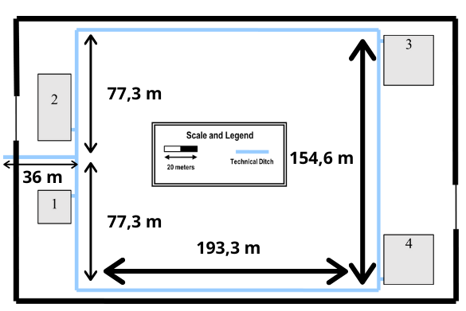
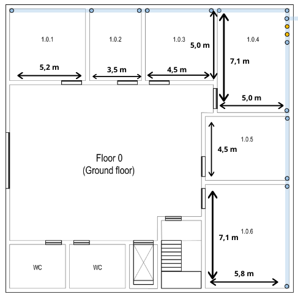
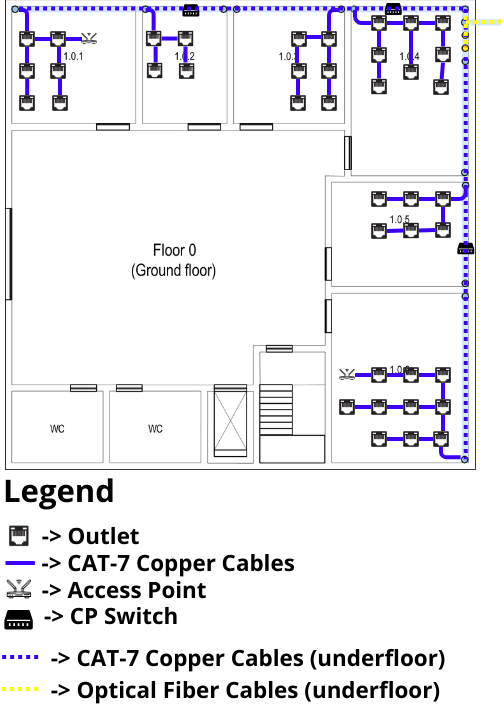
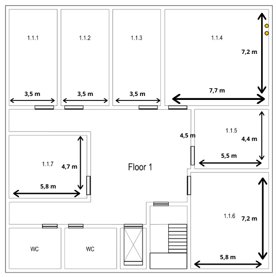
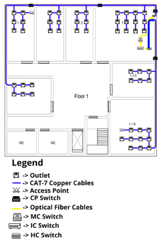

# T.1.1 - Development of a structured cabling project for building 1, encompassing the campus backbone.

## Campus Backbone

### Measurements

## Building 1

### Floor 0

#### Measurements

#### No. of outlets

| Room  | Length (m) | Width (m) | Area (m^2) | No. of outlets |
|-------|------------|-----------|------------|----------------|
| 1.0.1 | 5.2        | 4.9       | 25.5       | 6              |
| 1.0.2 | 3.5        | 4.9       | 17.2       | 4              |
| 1.0.3 | 4.3        | 4.9       | 21.1       | 6              |
| 1.0.4 | 5.0        | 7.1       | 35.5       | 8              |
| 1.0.5 | 5.8        | 4.5       | 26.1       | 6              |
| 1.0.6 | 5.8        | 7.1       | 41.2       | 10             |

#### Cabling

##### Total of outlets

-   40 + 2 (access points)

### Floor 1

#### Measurements

#### No. of outlets

| Room  | Length (m) | Width (m) | Area (m^2) | No. of outlets |
|-------|------------|-----------|------------|----------------|
| 1.1.1 | 3.5        | 7.2       | 25.2       | 6              |
| 1.1.2 | 3.5        | 7.2       | 25.2       | 6              |
| 1.1.3 | 3.5        | 7.2       | 25.2       | 6              |
| 1.1.4 | 7.7        | 7.2       | 55.4       | 12             |
| 1.1.5 | 5.5        | 4.4       | 24.2       | 6              |
| 1.1.6 | 5.8        | 7.2       | 41.7       | 10             |
| 1.1.7 | 5.8        | 4.7       | 27.3       | 6              |

##### Total of outlets

-   52 + 3 (access point)

#### Cabling

