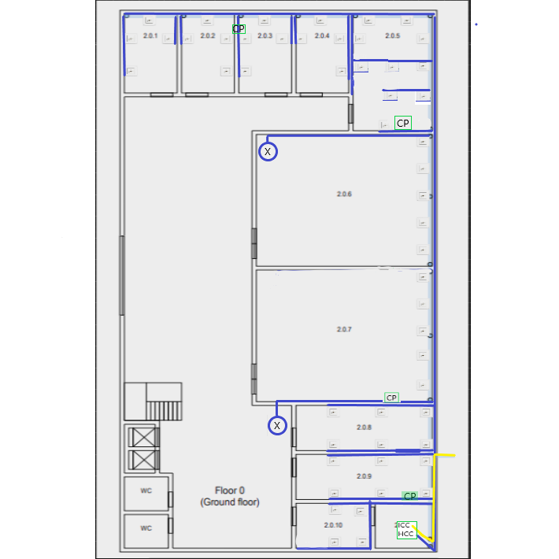
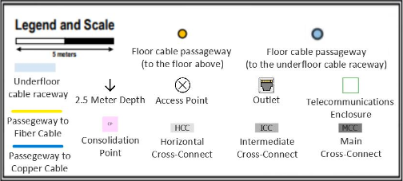
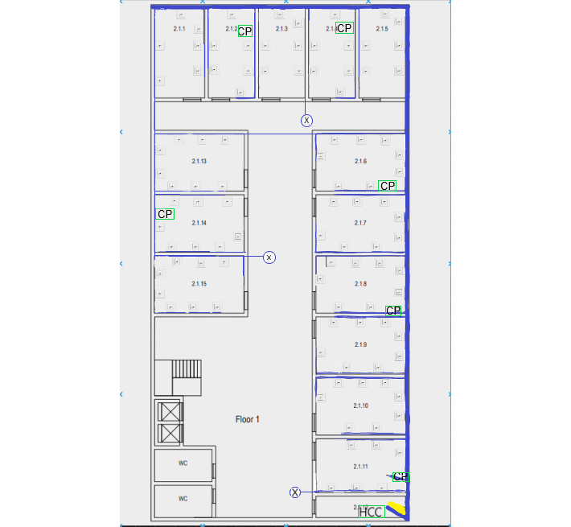

# RCOMP 2023-2024 Project

- #### Class: 2DJ
- #### Group: 4

# Sprint 1 Review

## Overview

Sprint 1 focuses on designing structured cabling systems tailored to specific requirements outlined in building construction plans. Our team undertook the challenge of crafting a suitable structured cabling system plan, leveraging our expertise and understanding of the unique demands associated with Buildings 1, 2, and 4.

## Buildings Utilized

Our structured cabling system plan encompasses Buildings 1, 2, and 4, each presenting distinct architectural layouts and connectivity needs.

Building 1 has the **Data Center** in the room 1.1.4, which means that this room has all the responsibility to connect every building. The **MCC (Main Cross-Connect)** will be connected to every **ICC (Intermediate Cross-Connect)**.

## Standards

### Access Point

To be able to get WI-FI network on every floor, we have decided to implement Access Points that, individually, cover 50 meters of diameter.

As walls and other obstacles can reduce this range, we will consider 20-30 meters as the maximum range for each Access Point.

### Cables

As defined by the team in the Planning section:

- Copper cables will be **Category 7 (CAT7) Copper Cables**.
- Fiber cables will be **Monomode Fiber Cables**.

The maximum distance of the Copper cables is **90** meters.

### Network Outlets

For each **10** square meters there should be installed **2** Network Outlets. The distance should not exceed **3** meters.

### Patch Panels

Since all connectors and patch panels should meet the cable specifications and we decided to use CAT7 Cables, all of them are also **CAT7**.
Fiber patch panels to Monomode Optical Fiber should be compatible as well.

### Cross-Connected

Cables connecting an **Intermediate Cross-Connect (ICC)** to a **Horizontal Cross-Connect (HCC)** are limited to **500 meters** long, and cables connecting the **Main Cross-Connect (MCC)** to an **ICC** are limited to **1500 meters** long.

### Copper Patch-Cords

Patch cords go from **0.5 to 5 meters** long. They will be provided to end-users to connect their equipment to outlets.

### Telecommunication Enclosures

Having the number of patch panels we can know the size of our Telecommunication Enclosure. Typical 24 ports CAT7 copper patch panels take **1U**.

**1U** is also added for each corresponding expected switch. And at the end, **100% oversize** must be added.

### Consolidation Point

Since we are using a large set of points of sale, a Consolidation Point must be placed to aggregate a bunch of outlets.

## Measurements

### Campus Backbone

### Building 1

#### Floor 0

#### Floor 1

### Building 2

#### Floor 0

[Building 2 Floor 0 Measurements](1220631/Building_2_Floor_0_Measurements.xlsx)

#### Floor 1

[Building 2 Floor 1 Measurements](1220631/Building_2_Floor_1_Measurements.xlsx)

### Building 4

#### Floor 0

#### Floor 1

## No. of outlets

### Building 1

#### Floor 0

| Room  | Length (m) | Width (m) | Area (m^2) | No. of outlets |
|-------|------------|-----------|------------|----------------|
| 1.0.1 | 5.2        | 4.9       | 25.5       | 6              |
| 1.0.2 | 3.5        | 4.9       | 17.2       | 4              |
| 1.0.3 | 4.3        | 4.9       | 21.1       | 6              |
| 1.0.4 | 5.0        | 7.1       | 35.5       | 8              |
| 1.0.5 | 5.8        | 4.5       | 26.1       | 6              |
| 1.0.6 | 5.8        | 7.1       | 41.2       | 10             |

#### Floor 1

| Room  | Length (m) | Width (m) | Area (m^2) | No. of outlets |
|-------|------------|-----------|------------|----------------|
| 1.1.1 | 3.5        | 7.2       | 25.2       | 6              |
| 1.1.2 | 3.5        | 7.2       | 25.2       | 6              |
| 1.1.3 | 3.5        | 7.2       | 25.2       | 6              |
| 1.1.4 | 7.7        | 7.2       | 55.4       | 12             |
| 1.1.5 | 5.5        | 4.4       | 24.2       | 6              |
| 1.1.6 | 5.8        | 7.2       | 41.7       | 10             |
| 1.1.7 | 5.8        | 4.7       | 27.3       | 6              |

### Building 2

#### Floor 0

| Room   | Area (m^2) | No. of outlets |
|--------|------------|----------------|
| 2.0.1  | 19.23      | 4              |
| 2.0.2  | 19.23      | 4              |
| 2.0.3  | 19.23      | 4              |
| 2.0.4  | 19.23      | 4              |
| 2.0.5  | 40.8       | 10             |
| 2.0.6  | 108.3      | 5              |
| 2.0.7  | 108.3      | 5              |
| 2.0.8  | 29.17      | 6              |
| 2.0.9  | 29.17      | 6              |
| 2.0.10 | 8.65       | 4              |
| 2.0.11 | 6.76       | 0              |

#### Floor 1

| Room   | Area (m^2) | No. of outlets |
|--------|------------|----------------|
| 2.1.1  | 26.91      | 6              |
| 2.1.2  | 26.91      | 6              |
| 2.1.3  | 26.91      | 6              |
| 2.1.4  | 26.91      | 6              |
| 2.1.5  | 26.91      | 6              |
| 2.1.6  | 31.83      | 8              |
| 2.1.7  | 31.83      | 8              |
| 2.1.8  | 31.83      | 8              |
| 2.1.9  | 31.83      | 8              |
| 2.1.10 | 31.83      | 8              |
| 2.1.11 | 31.83      | 6              |
| 2.1.12 | 13.84      | 0              |
| 2.1.13 | 31.83      | 8              |
| 2.1.14 | 31.83      | 8              |
| 2.1.15 | 31.83      | 8              |

### Building 4

#### Floor 0

| Room    | Length (m) | Width (m)	  | Area (m^2) | No. of outlets |
|---------|------------|-------------|------------|----------------|
| 4.0.1	  | 5,38	      | 5,38        | 28,94      | 6              |
| 4.0.2   | 	11,54	    | 11,54       | 	133,1716	 | 2              | 
| 4.0.3	  | 6,73       | 	3,2	       | 21,536     | 	6             |    
| 4.0.4   | 	6,73	     | 3,2	        | 21,536     | 	6             |   
| 4.0.5	  | 6,73	      | 3,2	        | 21,536     | 	6             |     
| 4.0.6	  | 6,73	      | 3,2	        | 21,536     | 	6             |     
| 4.0.7	  | 6,73	      | 3,2         | 	21,536    | 	6             |    
| 4.0.8	  | 6,73       | 	3,2        | 	21,536	   | 6              | 
| 4.0.9	  | 6,73       | 	3,2	       | 21,536	    | 6              |
| 4.0.10	 | 6,73       | 	3,2	       | 21,536	    | 6              |
| 4.0.11	 | 6,73       | 	3,2	       | 21,536	    | 6              |
| 4.0.12  | 	3,27	     | 3,85	       | 12,5895	   | 0              |

#### Floor 1

| Room   | Length (m) | Width (m) | Area (m^2) | No. of outlets |
|--------|------------|-----------|------------|----------------|
| 4.1.1  | 6,92       | 10        | 69,2       | 14             |
| 4.1.2  | 6,15       | 3,85      | 23,68      | 6              |
| 4.1.3  | 6,15       | 3,85      | 23,68      | 6              |
| 4.1.4  | 9,62       | 5,38      | 51,76      | 12             |
| 4.1.5  | 6,73       | 3,85      | 25,91      | 6              |
| 4.1.6  | 6,73       | 3,85      | 25,91      | 6              |
| 4.1.7  | 6,73       | 3,85      | 25,91      | 6              |
| 4.1.8  | 6,73       | 3,85      | 25,91      | 6              |
| 4.1.9  | 6,73       | 3,85      | 25,91      | 6              |
| 4.1.10 | 6,73       | 3,85      | 25,91      | 6              |
| 4.1.11 | 6,15       | 3,85      | 23,68      | 6              |
| 4.1.12 | 6,15       | 3,85      | 23,68      | 6              |
| 4.1.13 | 5,57       | 3,85      | 21,44      | 6              |
| 4.1.14 | 5,57       | 3,85      | 21,44      | 6              |
| 4.1.15 | 5,57       | 3,85      | 21,44      | 6              |
| 4.1.16 | 5,57       | 3,85      | 21,44      | 6              |
| 4.1.17 | 5,57       | 3,85      | 21,44      | 6              |
| 4.1.18 | 5,57       | 3,85      | 21,44      | 6              |
| 4.1.19 | 3,27       | 1,93      | 6,31       | 0              |
| 4.1.20 | 6,35       | 1,93      | 12,26      | 0              |

## Total of outlets

### Building 1

#### Floor 0

-   **40 + 2 (access points)**

#### Floor 1

-   **52 + 2 (access points)**

### Building 2

#### Floor 0

-   **52 + 2 (access points)**

#### Floor 1

-   **100 + 3 (access points)**

### Building 4

#### Floor 0

- **68 + 3 (Access Points)**

#### Floor 1

- **124 + 4 (Access Points)**

## Cabling

### Campus Backbone

### Building 1

#### Floor 0

#### Floor 1

### Building 2

#### Floor 0

#### Floor 1

### Building 4

#### Floor 0

#### Floor 1

## Cable Measurements

### Building 1

#### Floor 0

##### CAT-7 Copper Cables

The order of outlets in relation to cable structure is: ⬇️ - ➡️ - ⬇️ - ⬅️ - ⬅️- ⬇️ - ⬅️ - ⬆️

- From **HCC** to **CP (1.0.4)** -> **7,4 m**
- From **CP (1.0.4)** to **Outlets (1.0.4)** -> 2,8 m + 4,2 m + 5,6 m + 4,2 m + 6,2 m + 5,6 m + 7,0 m + 8,4 m = **44,0 m**
- From **CP (1.0.4)** to **Outlets (1.0.3)** -> 3,2 m + 4,6 m + 6,0 m + 4,6 m + 6,0 m + 7,4 m = **31,8 m**
- From **HCC** to **CP (1.0.2)** -> **16,2 m**
- From **CP (1.0.2)** to **Outlets (1.0.2)** -> 3,4 m + 4,8 m + 4,8 m + 6,2 m = **19,2 m**
- From **CP (1.0.2)** to **Outlets (1.0.1)** -> 9,4 m + 10,8 m + 12,2 m + 10,8 m + 12,2 m + 13,6 m = **69,0 m**
- From **HCC** to **Outlets (1.0.5)** -> 7,4 m + 8,8 m + 10,2 m + 8,8 m + 10,2 m + 11,6 m = **57,0 m**
- From **HCC** to **CP (1.0.5)** -> **10,5 m**
- From **CP (1.0.5)** to **Outlets (1.0.6)** -> 11,5 m + 12,9 m + 14,3 m + 12,9 m + 14,3 m + 15,7 m + 17,1 m + 14,3 m + 15,7 m + 17,1 m + 18,5 m = **164,3 m**

##### Monomode Optical Fiber Cables

- From **Backbone** to **Floor 0** -> **63,3 m**
- From **Floor 0** to **HCC** -> **7,9 m**

#### Floor 1

**The Horizontal Cross-Connect (HCC) and the Consolidation Point (CP) must be placed 1.5 m from the floor. The outlets must be rated 2.5 m from the removable dropped ceiling.**

##### CAT-7 Copper Cables

The order of outlets in relation to cable structure is: ⬇️ - ➡️ - ⬇️ - ⬅️ - ⬅️- ⬇️ - ⬅️ - ⬆️

- From **HCC** to **CP (Middle 1.1.4)** -> **5,3 m**
- From **CP (Middle 1.1.4)** to **Outlets (1.1.4)** -> 2,8 m + 4,2 m + 5,6 m + 4,2 m + 5,6 m + 7,0 m + 5,6 m + 7,0 m + 8,4 m + 7,0 m + 8,4 m + 9,8 m = **75,6 m**
- From **HCC** to **CP (Left 1.1.4)** -> **13,3 m**
- From **CP (Left 1.1.4)** to **Outlets (1.1.3)** -> 3,4 m + 4,8 m + 6,2 m + 4,8 m + 6,2 m + 7,6 m = **33,0 m**
- From **CP (Left 1.1.4)** to **Outlets (1.1.2)** -> 6,7 m + 7,1 m + 8,5 m + 7,1 m + 8.5 m + 9,9 m = **47,8 m**
- From **HCC** to **CP (1.1.1)** -> **22,9 m**
- From **CP (1.1.1)** to **Outlets (1.1.1)** -> 3,4 m + 4,8 m + 6,2 m + 4,8 m + 6,2 m + 7,6 m + 8,7 m = **41,7 m**
- From **CP (1.1.1)** to **Outlets (1.1.7)** -> 15,4 m + 16,8 m + 18,2 m + 16,8 m + 18,2 m + 19,6 m = **105,0 m**
- From **HCC** to **CP (Down 1.1.4)** -> **9,3 m**
- From **CP (Down 1.1.4)** to **Outlets (1.1.5)** -> 3,4 m + 4,8 m + 6,2 m + 4,8 m + 6,2 m + 7,6 m = **33,0 m**
- From **CP (Down 1.1.4)** to **Outlets (1.1.6)** -> 13,4 m + 14,8 m + 16,2 m + 14,8 m + 16,2 m + 17,6 m + 19,0 m + 16,2 m + 17,6 m + 19,0 m + 22,9 m = **187,7 m**

##### Monomode Optical Fiber Cables

- From **Floor 0** to **MCC** -> **8,0 m**
- From **MCC** to **ICC** -> **1,4 m**
- From **ICC** to **HCC** -> **1,4 m**

### Building 2

#### Floor 0

##### CAT-7 Copper Cables

The order of outlets in relation to cable structure is: ⬇️ - ⬅️ - ➡️ -  ⬆️

**- **From HCC to CP(room 2.0.9):** 5,4 m
- **From CP(room 2.0.9) to Outlets 2.0.10:** 10,8 m + 8,2 m + 7,8 m + 5,2 m = 32 m
- **From CP(room 2.0.9) to Outlets 2.0.9:** 7,2 m + 4,2 m + 1,8 m + 10,8 m + 8,6 m + 5,2 m = 37,8 m
- **From CP(room 2.0.9) to Outlets 2.0.8:** 17,4 m + 15,2 m + 12 m + 15,4 m + 12,2 m + 9,8 m = 82 m

- **From HCC to CP(room 2.0.7):** 13,8 m
- **From CP(room 2.0.7) to AP Outlet (left 2.0.8):** 8,6 m
- **From CP(room 2.0.7) to Outlets 2.0.7:** 2,4 m + 4,4 m + 6,4 m + 8,4 m + 10,4 m = 32 m
- **From CP(room 2.0.7) to Outlets 2.0.6:** 13,2 m + 15,2 m + 17,2 m + 19,2 m + 21,2 m = 86 m
- **From CP(room 2.0.7) to AP Outlet (2.0.6):** 32 m

- **From HCC to CP(room 2.0.5):** 34,6 m
- **From CP(room 2.0.5) to Outlets 2.0.10:** 1,6 m + 6,4 m + 3,2 m + 10,2 m + 8,4 m + 5,2 m + 16,4 m + 7,8 m + 13,2 m + 11 m = 83,4 m
- **From CP(room 2.0.5) to Outlets 2.0.4:** 26,8 m + 20,6 m + 23,8 m + 20 m = 91,2 m

- **From HCC to CP(room 2.0.3):** 55,8 m
- **From CP(room 2.0.3) to Outlets 2.0.3:** 4,4 m + 1,4 m + 5,8 m + 3,2 m = 14,8 m
- **From CP(room 2.0.3) to Outlets 2.0.2:** 12,4 m + 6,6 m + 9,6 m + 5,8 m = 34,4 m
- **From CP(room 2.0.3) to Outlets 2.0.1:** 13,6 m + 10,6 m + 13,4 m + 9,8 m = 47,4 m

##### Monomode Optical Fiber Cables

#### First Option ####
- **From MCC to ICC (ICC to outside of building) + (Celing height MCC to floor) + (Building 1 to Building 2):** 12,8 m + 4 m + 40 m = 56,8 m
- **From ICC to HCC:** 0,5 m
- **From ICC to 1st Floor Cable Length:** 0,9 m + 4 m = 4,9 m

#### Second Option ####

- **From MCC to ICC (ICC to outside of building) + (Celing height MCC to floor) + (Building 1 to Building 2):** 12,8 m + 4 m + 663,3 m = 680,1 m

#### Floor 1

**The Horizontal Cross-Connect (HCC) and the Consolidation Point (CP) must be placed 1.5 m from the floor. The outlets must be rated 2.5 m from the removable dropped ceiling.**

##### CAT-7 Copper Cables

The order of outlets in relation to cable structure is: ⬇️ - ⬅️ - ➡️ - ⬆️

- **From HCC to CP(room 2.1.11):** 1 m (up) + 2,6 m + 1 m (down) = 4,6 m
- **From CP(room 2.1.11) to AP Outlet (left B.1.11):** 1 m (up) + 9,4 m + 2,5 m (down) = 12,9 m
- **From CP(room 2.1.11) to Outlets 2.1.11:** (6 * 1 m (up) + 6 * 2,5 m (down)) + 7,8 m + 5,8 m + 3,6 m + 2,8 m + 7,8 m + 5,6 m = 54,4 m
- **From CP(room 2.1.11) to Outlets 2.1.10:** (8 * 1 m (up) + 8 * 2,5 m (down)) + 8,6 m + 6,6 m + 5,8 m + 18,4 m + 7,8 m + 15 m + 13 m + 11 m = 114 m
- **From CP(room 2.1.11) to Outlets 2.1.9:** (8 * 1 m (up) + 8 * 2,5 m (down)) + 13,6 m + 11,6 m + 18,2 m + 11 m + 13 m + 20,2 m + 18,2 m + 16,2 m = 150 m

- **From HCC to CP(room 2.1.8):** 1 m (up) + 17,2 m + 1 m (down) = 19,2 m
- **From CP(room 2.1.8) to Outlets 2.1.8:** (8 * 1 m (up) + 8 * 2,5 m (down)) + 3,8 m + 1,8 m + 2,8 m + 15,2 m + 4,8 m + 11,8 m + 9,8 m + 7,8 m = 85,6 m
- **From CP(room 2.1.8) to Outlets 2.1.7:** (8 * 1 m (up) + 8 * 2,5 m (down)) + 10,6 m + 8,6 m + 12,4 m + 7,8 m + 9,8 m + 17 m + 15 m + 13 m = 122,2 m

- **From HCC to CP(room 2.1.6):** 1 m (up) + 27,6 m + 1 m (down) = 29,6 m
- **From CP(room 2.1.6) to Outlets 2.1.6:** (8 * 1 m (up) + 8 * 2,5 m (down)) + 3,8 m + 1,6 m + 2,8 m + 15,2 m + 4,8 m + 11,8 m + 9,8 m + 7,8 m = 85,6 m
- **From CP(room 2.1.6) to Outlets 2.1.5:** (6 * 1 m (up) + 6 * 2,5 m (down)) + 25,8 m + 10,8 m + 23,4 m + 13,2 m + 15,4 m + 18,4 m = 128 m

- **From HCC to CP(room 2.1.4):** 1 m (up) + 46,4 m + 1 m (down) = 48,4 m
- **From CP(room 2.1.4) to Outlets 2.1.4:** (6 * 1 m (up) + 6 * 2,5 m (down)) + 7,2 m + 10,2 m + 4,4 m + 7,8 m + 2 m + 2,8 m = 55,4 m
- **From CP(room 2.1.4) to Outlets 2.1.3:** (6 * 1 m (up) + 6 * 2,5 m (down)) + 14,4 m + 10,8 m + 12,2 m + 8,4 m + 6,2 m + 7 m = 80 m
- **From CP(room 2.1.4) to AP Outlet (down 2.1.3):** 1 m (up) + 12,8 m + 2,5 m (down) = 16,3 m

- **From HCC to CP(room 2.1.2):** 1 m (up) + 54,8 m + 1 m (down) = 56,8 m
- **From CP(room 2.1.2) to Outlets 2.1.2:** (6 * 1 m (up) + 6 * 2,5 m (down)) + 7,2 m + 10,2 m + 4,4 m + 7,8 m + 2 m + 2,8 m = 55,4 m
- **From CP(room 2.1.6) to Outlets 2.1.1:** (6 * 1 m (up) + 6 * 2,5 m (down)) + 14,8 m + 10,8 m + 12,4 m + 8,4 m + 6,2 m + 7 m = 80,6 m
- **From CP(room 2.1.6) to Outlets 2.1.13:** (8 * 1 m (up) + 8 * 2,5 m (down)) + 26,2 m + 28,2 m + 30,2 m + 22,8 m + 20,8 m + 21,6 m + 23,6 m + 25,6 m = 227 m

- **From HCC to CP(room 2.1.14):** 1 m (up) + 79 m + 1 m (down) = 57,4 m
- **From CP(room 2.1.14) to Outlets 2.1.14:** (8 * 1 m (up) + 8 * 2,5 m (down)) + 5 m + 7 m + 9 m + 1,6 m + 11,8 m + 2,8 m + 4,8 m + 6,8 m = 76,8 m
- **From CP(room 2.1.14) to Outlets 2.1.15:** (8 * 1 m (up) + 8 * 2,5 m (down)) + 10 m + 12 m + 14 m + 6,8 m + 4,8 m + 5,6 m + 7,6 m + 9,6 m = 98,4 m
- **From CP(room 2.1.14) to AP Outlet (right 2.1.15):** 1 m (up) + 11,2 m + 2,5 m (down) = 14,7 m

**Total Cable Length:** 1673,3 m

***Monomode Fiber Cable:***

- **From floor cable passageway to HCC:** 1,5 m (to HCC) + 0,9 m = 2,4 m
- **Total Cable Length:** 2,4 m

### Building 4

#### Floor 0

##### CAT-7 Copper Cables

The order of outlets in relation to cable structure is: ⬇️ - ➡️ - ⬇️ - ⬅️ - ⬅️- ⬇️ - ⬅️ - ⬆️

- From **HCC** to **CP (4.0.3)** -> **42.21 m**
- From **CP (4.0.3)** to **Outlets (4.0.1)** -> 30,78 m + 30,00 m + 29,22 m + 27,97 m + 27,97 + 29,85 m + 30,48 m (AP) = **205,27 m**
- From **CP (4.0.3)** to **Outlets (4.0.2)** -> 12,03 m + 10,93 m = **22,96 m**
- From **CP (4.0.3)** to **Outlets (4.0.3)** -> 5,16 m +4,22 m + 2,66 + 0,31 m + 1,87 m + 2,81 m = **16,03 m**
- From **CP (4.0.3)** to **Outlets (4.0.4)** -> 13,13 m + 12,19 m + 10,78 m + 11,56 m + 12,97 m + 13,91m = **74,54 m**
- From **HCC** to **CP (4.0.6)** -> **29,84 m**
- From **CP (4.0.6)** to **Outlets (4.0.5)** -> 11,51 m + 10,57 m + 9,01 m + 9,94 m + 10,88 m + 11,82 m = **63,83 m**
- From **CP (4.0.6)** to **Outlets (4.0.6)** -> 5,16 m + 4,22 m + 2,66 m + 0,31 m + 1,87 m + 2,81 m + 3,90 m (AP) = **20,93 m**
- From **CP (4.0.6)** to **Outlets (4.0.7)** -> 4,21 m + 3,27 m + 1,4 m + 4,06 m + 5,7 m + 6,64 m = **25,28 m**
- From **HCC** to **CP (4.0.10)** -> **31,72 m**
- From **CP (4.0.10)** to **Outlets (4.0.8)** -> 12,82 m + 11,88 m + 10,52 m + 7,66 m + 9,22 m + 10,16 m = **62,26 m**
- From **CP (4.0.10)** to **Outlets (4.0.9)** -> 9,38 m + 8,44 m 6,88 m + 4,22 m + 5,78 m + 6,72 m = **41,42 m**
- From **CP (4.0.10)** to **Outlets (4.0.10)** -> 5,16 m + 4,22 m + 2,66 m + 0,31 m + 1,87 m + 2,81 m + 3,90 m (AP) = **20,93 m**
- From **CP (4.0.10)** to **Outlets (4.0.11)** -> 3,28 + 2,34 + 0,78 + 3,44 + 4,96 + 5,9 = **20,7 m**
- From **HCC** to **Outlet (4.0.12)** -> **1,56 m (AP)**

##### Monomode Fiber Cables

- From **MCC(Building 1)** to **ICC** -> **261,56 m**
- From **ICC** to **HCC** -> **1,09 m**

#### Floor 1

##### CAT-7 Copper Cables

The order of outlets in relation to cable structure is: ⬇️ - ➡️ - ⬇️ - ⬅️ - ⬅️- ⬇️ - ⬅️ - ⬆️

- From **HCC** to **CP (4.1.1)** -> **28,28 m**
- From **CP (4.1.1)** to **Outlets (4.1.1)** -> 20,01 m + 19,04 m + 18,13 + 16,25 m + 13,74m + 11,87 m + 9,99 m + 8,11 m + 6,08 m + 3,89 m + 2,95 m + 1,55 m + 1,72 m + 2,97 m = **144,31 m**
- From **CP (4.1.1)** to **Outlet AP** -> **2,19 m**
- From **CP (4.1.1)** to **Outlets (4.1.2)** -> 1,1 m + 2,5 m + 4,06 m + 4,69 m + 5,32 m + 5,95 m = **23,62 m**
- From **CP (4.1.1)** to **Outlets (4.1.3)** -> 7,81 m + 9,69 m + 11,41 m + 12,66 m + 13,44 m + 14,22 m = **69,23 m**
- From **HCC** to **CP (4.1.4)** -> **33,59 m**
- From **CP (4.1.4)** to **Outlet AP** -> **4,38 m**
- From **CP (4.1.4)** to **Outlets (4.1.4)** -> 2,66 m + 4,06 m + 5,31 m + 6,25 m + 7,50 m + 9,06 m + 10,92 + 9,67 m p 8,27 m + 6,82 m + 5,47m + 2,81 m = **73,03 m**
- From **CP (4.1.4)** to **Outlets (4.1.5)** -> 2,65 m + 4,37 m p 6,09 m + 6,72 m + 7,35 m + 7,98 m = **35,16 m**
- From **CP (4.1.4)** to **Outlets (4.1.6)** -> 7,33 m + 9,05 m + 10,77 m + 11,4 m p 12,03 m + 12,66 m = **63,24 m**
- From **HCC** to **CP (4.1.8)** -> **25,47 m**
- From **CP (4.1.8)** to **Outlet AP** -> **3,75 m**
- From **CP (4.1.8)** to **Outlets (4.1.7)** -> 1,4 m + 2,81 m + 4,53 m + 6,09 m + 7,03 m 7,97 m = **29,83 m**
- From **CP (4.1.8)** to **Outlets (4.1.8)** -> 1,72 m + 3,44 m + 5,00 m + 5,78 m + 6,56 m + 7,34 m = **29,84 m**
- From **CP (4.1.8)** to **Outlets (4.1.9)** -> 5,28 m + 7,00 m + 8,56 m + 9,34 m + 10,12 m + 10,9 m = **51,2 m**
- From **CP (4.1.8)** to **Outlets (4.1.10)** -> 10,00 m + 11,72 m + 13,28 m + 14,06 m + 14,84 m + 15,62 m = **79,52 m**
- From **HCC** to **CP (4.1.12)** -> **28,28 m**
- From **CP (4.1.12)** to **Outlets (4.1.11)** -> 2,19 m + 0,94 m + 1,25 m + 1,88 m + 2,82 m + 3,75 m = **12,83 m**
- From **CP (4.1.12)** to **Outlets (4.1.12)** -> 1,56 m p 0,94 m + 2,03 m + 2,81m + 3,59 m + 4,37 m = **15,3 m**
- From **HCC** to **CP (4.1.16)** -> **8,75 m**
- From **CP (4.1.16)** to **Outlet AP** -> **3,75 m**
- From **CP (4.1.16)** to **Outlets (4.1.13)** -> 5,31 m + 6,87 m + 9,21 m + 10,15 m + 11,09 m + 12,03 m = **54,66 m**
- From **CP (4.1.16)** to **Outlets (4.1.14)** -> 11,25 m + 12,03 m + 12,81 m + 13,59 m + 14,37 m + 15,14 m = **79,19 m**
- From **CP (4.1.16)** to **Outlets (4.1.15)** -> 13,65 m + 12,87 m + 12,09 m + 13,03 m + 13,81 m + 14,9 m = **80,35 m**
- From **CP (4.1.16)** to **Outlets (4.1.16)** -> 1,09 m + 2,34 m + 3,59 m + 4,37 m + 5,15 m + 5,93 m = **22,47 m**
- From **CP (4.1.16)** to **Outlets (4.1.17)** -> 1,25 m + 2,81 m + 5,53 m + 5,31 m + 6,09 m + 6,87 m = **27,86 m**
- From **CP (4.1.16)** to **Outlets (4.1.18)** -> 6,25 m + 6,88 m + 7,51 + 8,61 m + 9,39 m + 10,17 m = **49,81 m**

##### Monomode Fiber Cables

- From **ICC (Ground Floor)** to **ICC (First Floor)** -> **4,10 m**

## Patch-Cords (0.5 m)

### Building 1

#### Floor 0

-   **40 + 2 (HCC)**

#### Floor 1

-   **52 + 2 (ICC to HCC)**

### Building 2

#### Floor 0

-   **54 + 1 (ICC to HCC)**

#### Floor 1

-   **103**

### Building 4

#### Floor 0

-   **68 + 3**

#### Floor 1

-   **124 + 4**

## User-Cords (5 m)

### Building 1

#### Floor 0

-   **40**

#### Floor 1

- **52**

### Building 2

#### Floor 0

-   **54**

#### Floor 1

- **103**

### Building 4

#### Floor 0

-   **68**

#### Floor 1

-   **124**

## Patch Panels

### Building 1

#### Floor 0

40 outlets are available on this floor, so a minimum of **two 24 patch panels** (or four 12 patch panels) are needed. To distribute the patch panels as best as possible, the following was placed:

- 1 patch panel of **24 ports** (HCC)
- 1 patch panel of **36 ports** (room 1.0.4)
- 1 patch panel of **24 ports** (room 1.0.2)
- 1 patch panel of **24 ports** (room 1.0.5)

#### Floor 1

52 outlets are available on this floor, so a minimum of **three 24-port patch panels** (or six 12-port patch panels) are needed. To distribute the patch panels as best as possible, the following was placed:

- 1 patch panel of **12 ports** (MCC)
- 1 patch panel of **12 ports** (ICC)
- 1 patch panel of **12 ports** (HCC)
- 1 patch panel of **24 ports** (Up-right of room 1.1.4)
- 1 patch panel of **24 ports** (Up-left of room 1.1.4)
- 1 patch panel of **36 ports** (Down-right of room 1.1.4)
- 1 patch panel of **24 ports** (room 1.1.1)

### Building 2

#### Floor 0

54 outlets are available on this floor, so a minimum of **3 24 patch panels** (or 5 12 patch panels) are needed. To distribute the patch panels as effective as possible, the following was placed:

- 1 patch panel of 12 ports (HCC);
- 1 patch panel of 12 ports (ICC);
- 1 patch panel of 24 ports (room 2.0.9)
- 1 patch panel of 24 ports (room 2.0.7)
- 1 patch panel of 24 ports (room 2.0.5)
- 1 patch panel of 24 ports (room 2.0.3)

#### Floor 1

103 outlets are available on this floor, so a minimum of **5 24-port patch panels** (or 6 12-port patch panels) are needed. To distribute the patch panels as efficient as possible, the following was placed:

- 1 patch panel of 12 ports (HCC);
- 1 patch panel of 24 ports (room 2.1.11)
- 1 patch panel of 24 ports (room 2.1.8)
- 1 patch panel of 24 ports (room 2.1.6)
- 1 patch panel of 24 ports (room 2.1.4)
- 1 patch panel of 24 ports (room 2.1.2)
- 1 patch panel of 24 ports (room 2.1.14)

### Building 4

#### Floor 0

71 outlets are available in this floor, so we will need at least **3** 24-port patch panels. Due to needing flexibility
and scalability we will use **one** 36 port patch panel. With this, our distribution will look like this:

- **1** 12-port patch panel (ICC)
- **1** 12-port patch panel (HCC)
- **1** 36-port patch panel (CP 4.0.3)
- **1** 24-port patch panel (CP 4.0.6)
- **1** 24-port patch panel (CP 4.0.10)

#### Floor 1

128 outlets are available in this floor, so we will need at least **6** 24-port patch panels. Due to needing flexibility
and scalability we will use **three** 36 port patch panel and one 48 port patch panel. With this, our distribution will look like this:

- **1** 12-port patch panel (HCC)
- **1** 36-port patch panel (CP 4.1.1)
- **1** 36-port patch panel (CP 4.1.4)
- **1** 36-port patch panel (CP 4.1.8)
- **1** 48-port patch panel (CP 4.1.12)

## Telecomunication enclosures

### Building 1

#### Floor 0

For the **Horizontal Cross-Connect**:

- **1U** for 1 copper patch panel of 24 ports (HCC)
- **1U** for expected corresponding switches
- **2U** an additional 100% over dimensioning

Total: **4U**

For the two **Consolidation Point (24 ports)**

- **1U** for 1 copper patch panels of 24 ports;
- **1U** expected corresponding switch;
- **2U** an additional 100% over dimensioning.

Total: **4U** - Commercially available telecommunications enclosures start at 6U, so we will use one of those.

For one **Consolidation Point (36 ports)**

- **2U** for 1 copper patch panels of 36 ports;
- **1U** expected corresponding switch;
- **3U** and additional 100% over dimensioning.

Total: **6U** - Commercially available telecommunications enclosures is actually 6U, so we will use on of those.

#### Floor 1

For the **Horizontal Cross-Connect**, **Intermediate Cross-Connect** and **Main Cross-Connect**:

- **1U** for 1 copper patch panel of 12 ports (HCC)
- **1U** for 1 fiber patch panel of 12 ports (ICC)
- **1U** for 1 fiber patch panel of 12 ports (MCC)
- **1U** for expected corresponding switches
- **4U** an additional 100% over dimensioning

Total: **8U**

For the three **Consolidation Point (24 ports)**

- **1U** for 1 copper patch panels of 24 ports;
- **1U** expected corresponding switch;
- **2U** an additional 100% over dimensioning.

Total: **4U** - Commercially available telecommunications enclosures start at 6U, so we will use one of those.

For one **Consolidation Point (36 ports)**

- **2U** for 1 copper patch panels of 36 ports;
- **1U** expected corresponding switch;
- **3U** and additional 100% over dimensioning.

Total: **6U** - Commercially available telecommunications enclosures is actually 6U, so we will use on of those.

### ***Floor 0:*** ###

For the **HCC** and **ICC:**

- **1U** for 1 copper patch panels of 12 ports (HCC);
- **1U** for 1 fiber patch panel of 12 ports (ICC);
- **1U** expected corresponding switches;
- **3U** an additional 100% over dimensioning.
#### **Total**: 6U

For the four **CP (24 ports):**

- **1U** for 1 copper patch panels of 24 ports;
- **1U** expected corresponding switch;
- **2U** an additional 100% over dimensioning.
#### **Total**: 4U -  use one of the available telecommunications enclosures (6U).

### ***Floor 1*** ###

For the **HCC:**

- **1U** for 1 copper patch panels of 12 ports each (HCC);
- **1U** expected corresponding switches;
- **2U** an additional 100% over dimensioning.
#### **Total**: 4U - use one of the available telecommunications enclosures (6U).

For the six **CP (24 ports):**

- **1U** for 1 copper patch panels of 24 ports;
- **1U** expected corresponding switch;
- **2U** an additional 100% over dimensioning.
#### **Total**: 4U - use one of the available telecommunications enclosures (6U).

### Building 4

#### Floor 0

For the **HCC** and **ICC**:
- **1U** for the copper 12 port patch panel (HCC);
- **1U** for the fiber 12 port patch panel (ICC);
- **2U** For each of the corresponding switches;
- **4U** For a **100%** oversize.

Total: **8U**

For the **CP** in 4.0.3:
- **2U** for the 36 port patch panel;
- **1U** For the corresponding switch;
- **3U** For a **100%** oversize.

Total: **6U**

For the **CP** in 4.0.6:
- **1U** for the 24 port patch panel;
- **1U** For the corresponding switch;
- **2U** For a **100%** oversize.

Total: **4U** - As commercial enclosures start at **6U** we will use a **6U** enclosure.

For the **CP** in 4.0.10:
- **1U** for the 24 port patch panel;
- **1U** For the corresponding switch;
- **2U** For a **100%** oversize.

Total: **4U** - As commercial enclosures start at **6U** we will use a **6U** enclosure.

#### Floor 1

For the **HCC**:
- **1U** for the copper 12 port patch panel (HCC);
- **1U** For the corresponding switch;
- **2U** For a **100%** oversize.

Total: **4U** - As commercial enclosures start at **6U** we will use a **6U** enclosure.

For the **CP** in 4.1.1:
- **2U** for the 36 port patch panel;
- **1U** For the corresponding switch;
- **3U** For a **100%** oversize.

Total: **6U**

For the **CP** in 4.1.4:
- **2U** for the 36 port patch panel;
- **1U** For the corresponding switch;
- **3U** For a **100%** oversize.

Total: **6U**

For the **CP** in 4.1.8:
- **2U** for the 36 port patch panel;
- **1U** For the corresponding switch;
- **3U** For a **100%** oversize.

Total: **6U**

For the **CP** in 4.1.12:
- **2U** for the 48 port patch panel;
- **1U** For the corresponding switch;
- **3U** For a **100%** oversize.

Total: **6U**

## Full Inventory

### Building 1

| Floor     | No. of outlets | CAT-7 Copper Cables (m) | Monomode Fiber Cables (m) | Patch-Cords (0,5 m) | User-Cords (5 m) | Patch panels (12) | Patch panels (24) | Patch panels (36) | Telecommunication Enclosures | AP | CP (24) | CP (36) | Switches |
|-----------|----------------|-------------------------|---------------------------|---------------------|------------------|-------------------|-------------------|-------------------|------------------------------|----|---------|---------|----------|
| 0         | 40             | 419,4                   | 70,0                      | 42                  | 40               | 0                 | 3                 | 1                 | 4                            | 2  | 2       | 1       | 5        |
| 1         | 52             | 574,6                   | 10,4                      | 54                  | 52               | 3                 | 3                 | 1                 | 6                            | 2  | 3       | 1       | 6        |
| **Total** | 92             | 994,0                   | 80,4                      | 96                  | 92               | 3                 | 6                 | 2                 | 10                           | 4  | 5       | 2       | 11       |

### Building 2

| Floor     | No. of outlets | CAT-7 Copper Cables (m) | Monomode Fiber Cables (m) | Patch-Cords (0,5 m) | User-Cords (5 m) | Patch panels (12) | Patch panels (24) | Telecommunication Enclosures | AP | CP (24) | CP (12) | Switches |
|-----------|----------------|-------------------------|---------------------------|---------------------|------------------|-------------------|-------------------|------------------------------|----|---------|---------|----------|
| 0         | 54             | 691.2                   | 742.3                     | 55                  | 54               | 2                 | 4                 | 5                            | 2  | 4       | 0       | 5        |
| 1         | 103            | 1673.3                  | 2.4                       | 103                 | 103              | 1                 | 6                 | 7                            | 3  | 6       | 0       | 7        |
| **Total** | 157            | 2364.5                  | 744.7                     | 158                 | 157              | 3                 | 10                | 12                           | 5  | 10      | 0       | 12       |

### Building 4

| Floor | No. of outlets | CAT-7 Copper Cables (m) | Monomode Fiber Cables (m) | Patch-Cords (0,5 m) | User-Cords (5 m) | Patch panels (12) | Patch panels (24) | Patch panels (36) | Patch Panels (48) | Telecommunication Enclosures | AP | CP (24) | CP (36) | CP (48) | Switches |
|-------|----------------|-------------------------|---------------------------|---------------------|------------------|-------------------|-------------------|-------------------|-------------------|------------------------------|----|---------|---------|---------|----------|
| 0     | 71             | 648,07                  | 262,65                    | 71                  | 68               | 2                 | 2                 | 1                 | 0                 | 4                            | 3  | 2       | 1       | 0       | 5        |
| 1     | 128            | 1.010,57                | 4,10                      | 128                 | 124              | 1                 | 0                 | 3                 | 1                 | 4                            | 4  | 0       | 3       | 1       | 6        |

## Conclusion

Our cabling plan for Buildings 1, 2, and 4 is simple and effective. We made sure it fits each building's needs and is reliable and easy to use. With our plan, communication will be smooth, and everything will work well.

## Self-Assessment

| <- Read from  -> | 1221083 | 1220631 | 1221276 |
|------------------|---------|---------|---------|
| **1221083**      | 18      | 18      | 18      |
| **1220631**      | 18      | 18      | 18      |
| **1221276**      | 18      | 18      | 18      |
