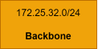

# RCOMP 2023-2024 Project - Sprint 2 - Member 1221083 Folder

## VLAN database and IPv4 network

### Building 1 IPv4 network diagram

### Campus Backbone IPv4 network diagram

### Building 1 VLAN-IPv4 network database/table

| Network       | VLAN ID | VLAN Name             | Total of Nodes | IP Address       | First Host    | Last Host     | Broadcast     | Sub-netting mask |
|---------------|---------|-----------------------|----------------|------------------|---------------|---------------|---------------|------------------|
| Ground Floor  | 406     | GFBuilding1VLAN       | 50             | 172.25.33.0/26   | 172.25.33.1   | 172.25.33.62  | 172.25.33.63  | 255.255.255.192  |
| 1st Floor     | 407     | FFBuilding1VLAN       | 50             | 172.25.33.64/26  | 172.25.33.65  | 172.25.33.126 | 172.25.33.127 | 255.255.255.192  |
| Wi-fi Network | 408     | WirelessBuilding1VLAN | 80             | 172.25.33.128/25 | 172.25.33.129 | 172.25.33.254 | 172.25.33.255 | 255.255.255.128  |
| DMZ           | 409     | DMZBuilding1VLAN      | 100            | 172.25.34.0/25   | 172.25.34.1   | 172.25.34.126 | 172.25.34.127 | 255.255.255.128  |
| VOIP          | 410     | VOIPBuilding1VLAN     | 67             | 172.25.34.128/25 | 172.25.34.129 | 172.25.35.254 | 172.25.35.255 | 255.255.255.128  |